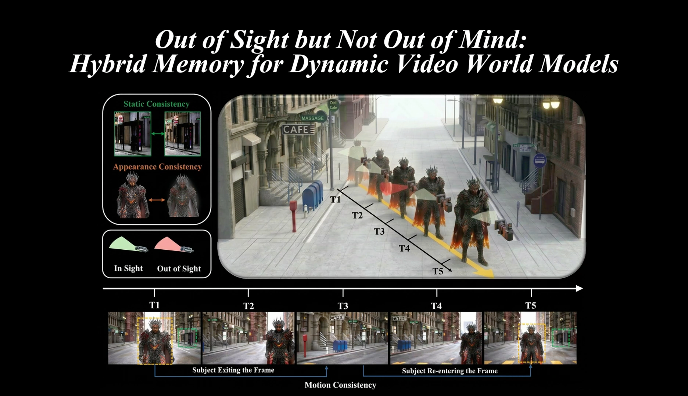
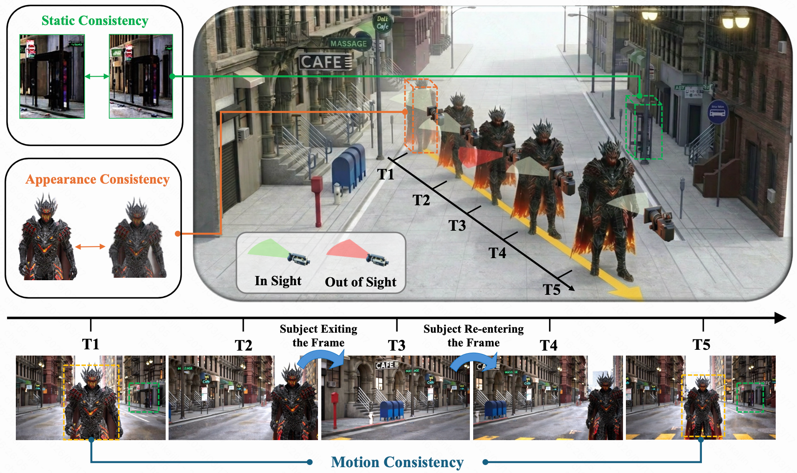
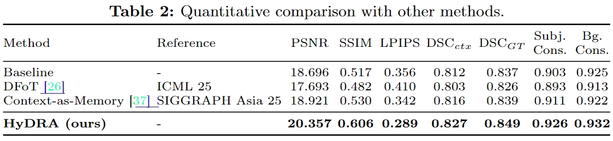

<h2 align="center"> Out of Sight but Not Out of Mind:<br>Hybrid Memory for Dynamic Video World Models </h2>


<div align="center">
  
</div>

<div align="center">
  <a href="https://arxiv.org/pdf/2603.25716"></a>
  <a href="https://kj-chen666.github.io/Hybrid-Memory-in-Video-World-Models/"></a>
  <a href="https://huggingface.co/datasets/KlingTeam/HM-World"></a>
  <a href="https://huggingface.co/H-EmbodVis/HyDRA"></a>
  <a href="https://opensource.org/licenses/Apache-2.0"></a>
</div>

<p align="center">
  Kaijin Chen<sup>1</sup>,
  <a href="https://dk-liang.github.io/">Dingkang Liang</a><sup>1</sup>,
  <a href="https://lmd0311.github.io/">Xin Zhou</a><sup>1</sup>,
  <a href="hhttps://yikang98.github.io/">Yikang Ding</a><sup>1</sup>,
  Xiaoqiang Liu<sup>2</sup>,
  Pengfei Wan<sup>2</sup>,
  <a href="https://scholar.google.com/citations?user=UeltiQ4AAAAJ&hl=en">Xiang Bai</a><sup>1</sup>
</p>

<p align="center">
  <sup>1</sup>Huazhong University of Science and Technology
  &nbsp;&nbsp;
  <sup>2</sup>Kling Team, Kuaishou Technology
</p>


<div align="center">
  <a href="./assets/demo.mp4">
    
  </a>
</div>

<p align="center">
  <a href="./assets/demo.mp4"><strong>demo</strong></a>
</p>

<!--
When the repository is public, you can optionally replace the block above with a direct embedded player
on platforms that support it, or keep the preview image + video link for better GitHub compatibility.
-->

## Overview

Recent video world models are good at simulating static environments, but they still struggle with a core challenge of the real world: dynamic subjects frequently move out of view and later re-enter the scene. In these cases, many existing methods lose subject identity or motion continuity, producing frozen, distorted, or disappearing objects.

HyDRA is built for this setting. It introduces a **hybrid memory** mechanism that treats world modeling as both:

- remembering stable scene structure, and
- tracking dynamic subjects through unseen intervals.

To support this direction, we also introduce **HM-World**, a large-scale dataset designed for studying dynamic memory in video world models.

<div align="center">
  
</div>

<details>
  <summary><strong>Abstract</strong></summary>
  <br>
  Video world models have shown immense potential in simulating the physical world, yet existing memory mechanisms primarily treat environments as static canvases. When dynamic subjects hide out of sight and later re-emerge, current methods often struggle, leading to frozen, distorted, or vanishing subjects. We introduce <strong>Hybrid Memory</strong>, a novel paradigm requiring models to simultaneously act as precise archivists for static backgrounds and vigilant trackers for dynamic subjects, ensuring motion continuity during out-of-view intervals. To facilitate research in this direction, we construct <strong>HM-World</strong>, the first large-scale video dataset dedicated to hybrid memory. It features 59K high-fidelity clips with decoupled camera and subject trajectories, encompassing 17 diverse scenes, 49 distinct subjects, and meticulously designed exit-entry events to rigorously evaluate hybrid coherence. Furthermore, we propose <strong>HyDRA</strong>, a specialized memory architecture that compresses contexts into memory tokens and utilizes a spatiotemporal relevance-driven retrieval mechanism. By selectively attending to relevant motion cues, HyDRA effectively preserves the identity and motion of hidden subjects. Extensive experiments on HM-World demonstrate that our method significantly outperforms state-of-the-art approaches in both dynamic subject consistency and overall generation quality.
</details>

## Highlights

- **A new problem setting** for video world models: preserving subject identity and motion after out-of-view intervals.
- **HM-World dataset** with 59K high-fidelity clips for hybrid memory research.
- **HyDRA architecture** with memory tokenization and spatiotemporal relevance-based retrieval.
- **Open-source release** of inference code, training skeleton, examples, and model checkpoints.

## Table of Contents

- [Overview](#overview)
- [News and Roadmap](#news-and-roadmap)
- [Getting Started](#getting-started)
- [Inference](#inference)
- [Training](#training)
- [Dataset](#dataset)
- [Citation](#citation)

## Generation Results

More visual results are available on the [project homepage](https://kj-chen666.github.io/Hybrid-Memory-in-Video-World-Models/).

<div align="center">
  
  
  
</div>
<div align="center">
  
  
  
</div>
<div align="center">
  
  
  
</div>

## Experimental Results

<div align="center">
  
</div>

## News and Roadmap

- [x] Paper released
- [x] HM-World dataset released
- [x] HyDRA checkpoints and inference code released
- [x] HyDRA training code released


## Getting Started

### 1. Clone the repository

```bash
git clone https://github.com/H-EmbodVis/HyDRA.git
cd HyDRA
```

### 2. Create the environment

```bash
conda create -n hydra python=3.10 -y
conda activate hydra
pip install -r requirements.txt
```


### 3. Download the base video model

HyDRA builds on **Wan2.1-T2V-1.3B**.

- Base model: [Wan-AI/Wan2.1-T2V-1.3B](https://huggingface.co/Wan-AI/Wan2.1-T2V-1.3B)
- Recommended location: `./ckpts/Wan2.1-T2V-1.3B/`

Expected structure:

```text
HyDRA/
|- ckpts/
|  |- hydra.ckpt
|  |- Wan2.1-T2V-1.3B/
|     |- Wan2.1_VAE.pth
|     |- diffusion_pytorch_model.safetensors
|     |- models_t5_umt5-xxl-enc-bf16.pth
|     |- ...
|- assets/
|- diffsynth/
|- examples/
|- infer_hydra.py
|- train_hydra.py
|- requirements.txt
```

### 4. Download the HyDRA checkpoint

- Checkpoint: [H-EmbodVis/HyDRA](https://huggingface.co/H-EmbodVis/HyDRA)
- Recommended path: `./ckpts/hydra.ckpt`

### 5. Run a quick sanity check

The repository already includes example videos, camera trajectories, and captions under `./examples`.

```bash
python infer_hydra.py
```

Generated videos will be saved to `./outputs` by default.

## Inference

### Run all packaged examples

```bash
python infer_hydra.py \
  --examples_dir ./examples \
  --ckpt_path ./ckpts/hydra.ckpt
```

### Run a single custom case

```bash
python infer_hydra.py \
  --cond_video ./path/to/cond_video.mp4 \
  --cond_json ./path/to/camera.json \
  --caption_txt ./path/to/prompt.txt \
  --ckpt_path ./ckpts/hydra.ckpt \
  --output_path ./outputs/custom_concat.mp4
```


## Training

This repository provides the HyDRA model definition and a training skeleton. You can plug in your own dataset and `DataLoader` with PyTorch Lightning.


### Data preparation

For each training sample:

1. Encode the source video into latent representations with the VAE.
2. Encode the caption into text embeddings with the text encoder.
3. Convert camera poses into the relative coordinate system expected by HyDRA.
4. Save the processed sample in a format your custom dataset loader can read.

### Initialize the training model

```bash
python train_hydra.py \
  --dit_path ./ckpts/Wan2.1-T2V-1.3B/diffusion_pytorch_model.safetensors \
  --hydra \
  --use_gradient_checkpointing
```

`train_hydra.py` initializes the training module but does not ship with a built-in dataset or trainer loop. To train end-to-end, connect it to your own `Dataset`, `DataLoader`, and `pl.Trainer(...).fit(...)`.

## Dataset

We release **HM-World**, a large-scale dataset tailored for hybrid memory research in dynamic video world models.

- Dataset page: [KlingTeam/HM-World](https://huggingface.co/datasets/KlingTeam/HM-World)
- Focus: decoupled camera motion and subject motion
- Designed for: exit-entry events, dynamic continuity, and long-horizon memory evaluation

If you use HM-World in your work, please cite the paper below.

## Acknowledgement

We thank the authors and teams behind the following projects and open-source efforts:

- [ReCamMaster](https://github.com/KlingAIResearch/ReCamMaster)
- [Context-As-Memory](https://context-as-memory.github.io)
- [DFoT](https://github.com/kwsong0113/diffusion-forcing-transformer)
- [WorldPlay](https://github.com/Tencent-Hunyuan/HY-WorldPlay)

## Citation

If you find this project useful in your research, please consider citing:

```bibtex
@article{chen2026out,
  title   = {Out of Sight but Not Out of Mind: Hybrid Memory for Dynamic Video World Models},
  author  = {Chen, Kaijin and Liang, Dingkang and Zhou, Xin and Ding, Yikang and Liu, Xiaoqiang and Wan, Pengfei and Bai, Xiang},
  journal = {arXiv preprint arXiv:2603.25716},
  year    = {2026}
}
```
